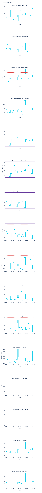

# London Weather

## Tools Used
Several tools were applied in this project to support development and ensure robust data workflows:
- **Great Expectations:** Used for validating and monitoring data quality before it is consumed by the model.
- **DVC (Data Version Control):** Employed to build and orchestrate data pipelines using DAGs, as well as to track data versions.
- **NannyML:** Applied to detect model drift over time.

## Great Expectations
...
## DVC
...

## NannyML
One of the biggest challenges after deploying a model is knowing when to retrain it. Retraining frequently can be expensive and time-consuming, and in many real-world cases, ground truth labels may not be immediately available—they might take months or even years to collect, or sometimes never arrive at all.
To address this, a practical approach is to:
- Start with a multivariate drift check to detect whether the overall data distribution has changed;
- If drift is detected, perform univariate drift checks on individual features to identify which variables are contributing to the shift.

This process helps prioritize retraining based on actual data changes and reveals where performance issues originate. Sometimes the architecture of the model or features need to be change, retraining might not be enough.

The model was trained on data from 1979 to 2019. Data from 2019 onward was then used to run the drift detection tests described above.

### Correlated Metrics for Drift
Data with correlated features evaluating drift (w/ pearson correlation and its p-values): 
Using this dataframe and the visualizations below, we observed a few drift alerts. However, none were statistically significant (p < 0.05), so retraining the model was not necessary.

### Multivariate Drift

### Univariate Drift

